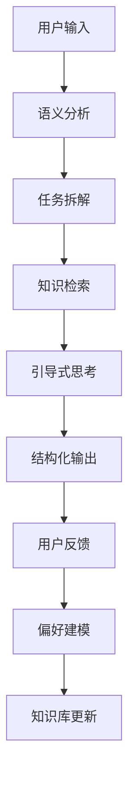

# AI工作流平台使用指南

## 系统概述

AI工作流平台是一个基于模块化设计的智能助手系统，能够：
- 🧠 **语义理解**: 自动识别用户意图和需求
- 📋 **任务拆解**: 将复杂目标分解为可执行的子任务
- 🔍 **知识检索**: 从本地知识库中找到相关信息
- 💭 **引导式思考**: 使用大语言模型进行深度推理
- 📊 **结构化输出**: 生成格式化的结果
- 🎯 **自我迭代**: 基于用户反馈不断优化

## 工作流程



## 使用场景

### 1. 问答场景
**输入**: "什么是深度学习？"
**处理流程**:
- 意图识别: question (问答类)
- 任务拆解: 理解问题 → 检索知识 → 分析整理 → 生成答案
- 知识检索: 从向量数据库中找到相关的深度学习资料
- 推理生成: 基于检索到的知识生成结构化答案

### 2. 任务执行场景
**输入**: "帮我制定一个学习Python的计划"
**处理流程**:
- 意图识别: task (任务类)
- 任务拆解: 明确目标 → 分析资源 → 制定计划 → 验证可行性
- 知识检索: 查找Python学习相关的资料和经验
- 推理生成: 生成个性化的学习计划

### 3. 分析场景
**输入**: "分析一下当前AI技术的发展趋势"
**处理流程**:
- 意图识别: analysis (分析类)
- 任务拆解: 收集数据 → 趋势分析 → 深入洞察 → 结论建议
- 知识检索: 获取AI技术相关的最新信息
- 推理生成: 生成分析报告

## 核心功能详解

### 语义分析
- **功能**: 识别用户输入的意图类别
- **支持类型**: 问答、任务、搜索、分析、创作、学习
- **输出**: 意图类别、置信度、关键词、实体等

### 任务规划
- **功能**: 将目标拆解为具体的执行步骤
- **特点**: 考虑依赖关系、优先级、时间估算
- **输出**: 结构化的任务列表

### 知识检索
- **技术**: 基于FAISS的向量相似度搜索
- **特点**: 支持语义搜索，不仅仅是关键词匹配
- **数据源**: 本地知识库、历史对话记录

### 推理模型
- **技术**: 集成OpenAI API或兼容的大语言模型
- **特点**: 模板驱动的引导式思考
- **输出**: 结构化的推理结果

### 偏好学习
- **功能**: 基于用户反馈学习个人偏好
- **数据**: 评分、反馈文本、使用模式
- **应用**: 个性化推荐、响应风格调整

## API接口

### 执行工作流
```http
POST /api/workflow/execute
Content-Type: application/json

{
    "query": "用户输入的问题或任务",
    "user_id": "用户ID（可选）"
}
```

### 提交反馈
```http
POST /api/feedback
Content-Type: application/json

{
    "workflow_id": "工作流ID",
    "rating": 5,
    "feedback": "反馈文本（可选）"
}
```

### 健康检查
```http
GET /api/health
```

## 配置说明

### 环境变量 (.env)
```bash
# OpenAI API配置
OPENAI_API_KEY=your_api_key_here
OPENAI_BASE_URL=https://api.openai.com/v1

# 数据库路径
VECTOR_DB_PATH=data/vector_db
PREFERENCES_DB_PATH=data/preferences.db

# 模型配置
EMBEDDING_MODEL=all-MiniLM-L6-v2
```

### 支持的API服务
- OpenAI GPT系列
- 阿里云通义千问 (DashScope)
- DeepSeek API
- 其他兼容OpenAI格式的API服务

## 数据管理

### 知识库管理
- **位置**: `data/vector_db/`
- **格式**: FAISS索引 + 元数据
- **添加知识**: 通过API或直接调用VectorDB类

### 偏好数据
- **位置**: `data/preferences.db`
- **格式**: SQLite数据库
- **内容**: 用户偏好、反馈记录、使用模式

### 备份建议
定期备份以下目录：
- `data/vector_db/` - 知识库数据
- `data/preferences.db` - 用户偏好数据

## 扩展开发

### 添加新的意图类型
1. 在 `IntentAnalyzer` 中添加新的意图模式
2. 在 `TaskPlanner` 中添加对应的任务模板
3. 在 `ReasoningModel` 中添加推理模板

### 集成新的模型
1. 实现模型接口
2. 在 `ReasoningModel` 中添加模型选择逻辑
3. 更新配置文件

### 自定义知识源
1. 实现数据导入脚本
2. 调用 `VectorDB.add_knowledge_base()` 方法
3. 定期更新知识库

## 故障排除

### 常见问题

**Q: 启动时提示"模块未找到"**
A: 运行 `python scripts/setup.py` 安装依赖

**Q: API调用失败**
A: 检查 `.env` 文件中的API密钥配置

**Q: 向量搜索结果不准确**
A: 增加知识库内容，或调整搜索参数

**Q: 响应速度慢**
A: 检查网络连接，考虑使用本地模型

### 日志查看
- 后端日志: 控制台输出
- 错误日志: `logs/` 目录（如果配置）

## 性能优化

### 推荐配置
- **内存**: 至少4GB可用内存
- **存储**: SSD硬盘，至少10GB可用空间
- **网络**: 稳定的互联网连接（用于API调用）

### 优化建议
1. 定期清理过期的工作流记录
2. 优化知识库大小，删除重复内容
3. 使用本地模型减少API调用延迟
4. 启用缓存机制

## 安全考虑

- 所有敏感数据本地存储
- API密钥加密保存
- 用户数据隔离
- 定期安全更新